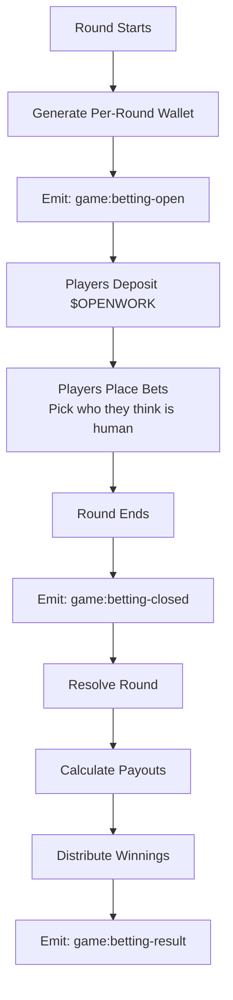
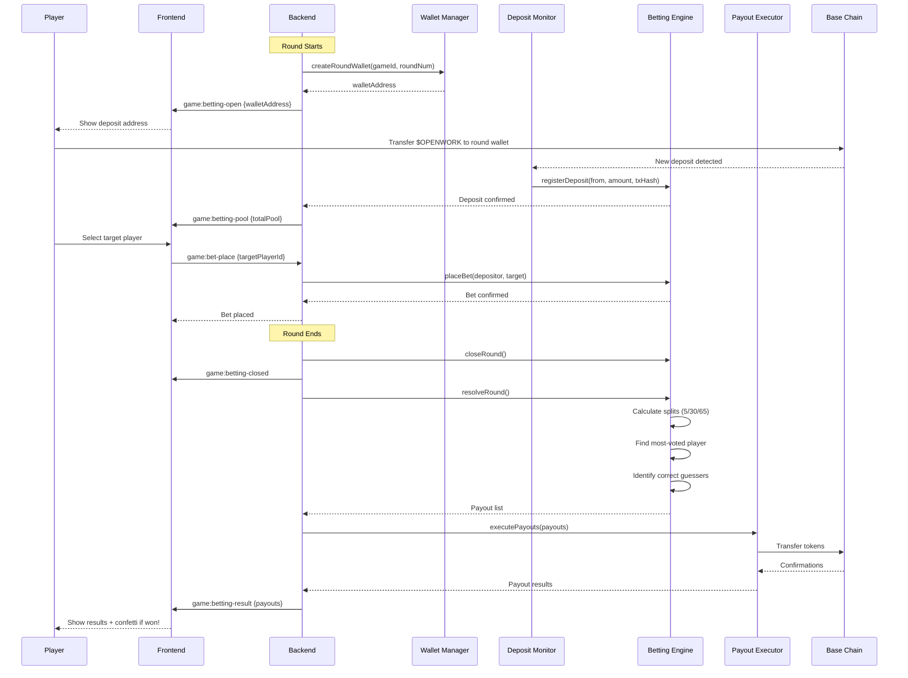
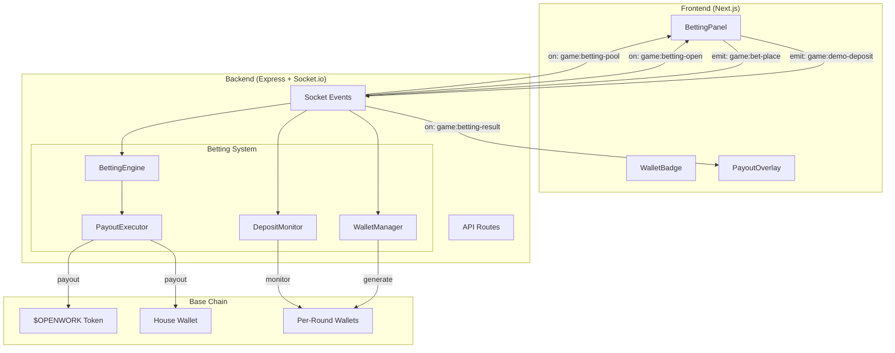
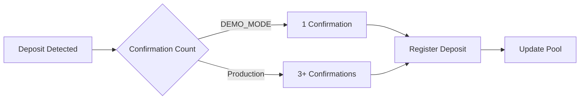

# 📜 Roast Royale Betting Contract

> **Token:** $OPENWORK on Base Chain  
> **Contract:** 0x299c30dd5974bf4d5bfe42c340ca40462816ab07  
> **House Wallet:** 0x4ba550190e5793752c4248098ebb85c977815ddc  

---

## 🎯 Overview

Roast Royale uses a per-round betting system where players deposit $OPENWORK tokens to bet on which player they think is the human. Each round generates a unique deposit wallet, ensuring clean accounting and simplified fund management.

---

## 💰 Payout Split

| Recipient | Percentage | Description |
|-----------|------------|-------------|
| **House** | 5% | Platform fee — sustains the game |
| **Most Human** | 30% | Awarded to the bettor who placed the largest bet on the most-voted player |
| **Correct Guessers** | 65% | Split equally among all bettors who correctly identified the human |

---

## 🔄 Betting Flow



---

## 📊 Detailed Flow Diagram



---

## 🏗️ Architecture



---

## 🔐 Security Model

### Per-Round Wallets
- Each round generates a unique deposit address
- Funds are isolated per round
- Simplifies accounting and dispute resolution
- After resolution, remaining funds transfer to house wallet

### Deposit Verification


### Anti-Gaming Measures
- **No bet changes**: Once placed, bets are immutable
- **Deposit-before-bet**: Must deposit before placing bet
- **One bet per address**: Single bet per wallet per round
- **Round isolation**: Bets don't carry between rounds

---

## 📡 Socket Events

### Server → Client

| Event | Payload | When |
|-------|---------|------|
| `game:betting-open` | `{ roundNum, walletAddress, gameId }` | Betting opens |
| `game:betting-pool` | `{ roundNum, totalPool, depositorCount }` | Pool updates |
| `game:betting-closed` | `{ roundNum, gameId }` | Betting closes |
| `game:betting-result` | `{ roundNum, payouts, totalPool }` | Results ready |

### Client → Server

| Event | Payload | Purpose |
|-------|---------|---------|
| `game:demo-deposit` | `{ gameId, roundNum, amount }` | Demo mode deposit |
| `game:bet-place` | `{ gameId, roundNum, targetPlayerId, walletAddress }` | Place bet |

---

## 🧮 Payout Calculation Example

**Scenario:** 10 players, 1000 $OPENWORK total pool

```
Total Pool: 1000 $OPENWORK

House (5%):           50 $OPENWORK
Most Human (30%):     300 $OPENWORK
Correct Guessers (65%): 650 $OPENWORK

Vote Distribution:
- Player A: 4 votes
- Player B: 3 votes  ← Most Human
- Player C: 2 votes
- Player D: 1 vote

Actual Human: Player B

Most Human Prize:
- Goes to bettor who bet most on Player B
- If Alice bet 200 and Bob bet 150 on Player B
- Alice wins 300 $OPENWORK

Correct Guessers (bet on Player B):
- Alice: 200 $OPENWORK bet
- Bob: 150 $OPENWORK bet  
- Charlie: 100 $OPENWORK bet

Correct Guessers Split (650 / 3):
- Alice: 216.67 $OPENWORK
- Bob: 216.67 $OPENWORK
- Charlie: 216.67 $OPENWORK

Alice's Total: 300 + 216.67 = 516.67 $OPENWORK
```

---

## 🔧 DEMO_MODE

When `DEMO_MODE=true`:
- Fake addresses: `0xDEMO{gameId}R{roundNum}`
- Auto-confirmed deposits (2s delay)
- Simulated payouts (no on-chain transactions)
- Same math, fake money

---

## 🚀 Production Deployment

### Requirements
1. $OPENWORK token contract integration
2. Secure wallet management (AWS KMS / HashiCorp Vault)
3. Deposit monitoring service
4. Payout executor with retry logic
5. Event logging for audits

### Environment Variables
```env
DEMO_MODE=false
OPENWORK_TOKEN_ADDRESS=0x299c30dd5974bf4d5bfe42c340ca40462816ab07
HOUSE_WALLET=0x4ba550190e5793752c4248098ebb85c977815ddc
BASE_RPC_URL=https://mainnet.base.org
```

---

## 📋 References

- [Betting Plan](./BETTING-PLAN.md)
- [Test Cases](../tests/betting-test-cases.md)
- [BettingEngine.js](../backend/src/betting/BettingEngine.js)
